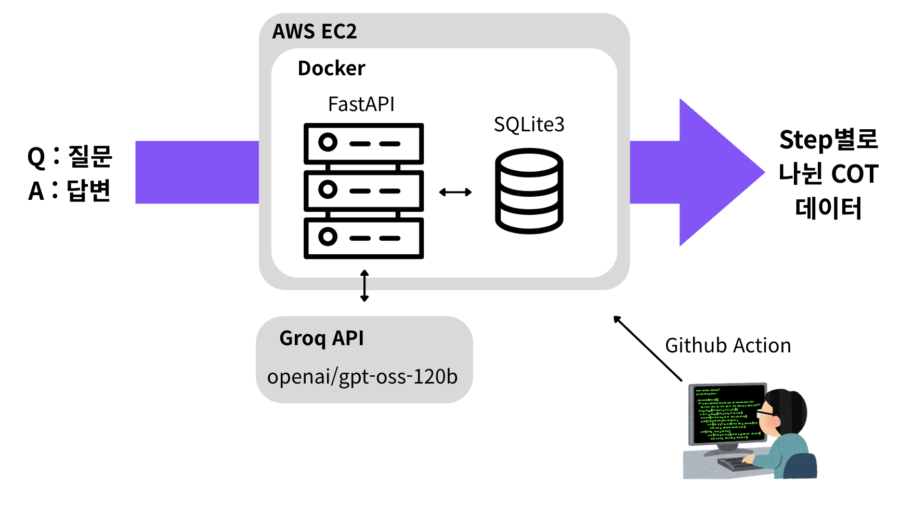

# QA → CoT Server

이 서버는 주어진 **Question과 Answer**를 받아 **Chain-of-Thought(Cot) 라벨링** 결과를 반환하는 간단한 백엔드 API 서버입니다.



- COT는 Groq의 LLM을 이용해 자동화를 했습니다.
- 결과는 SQLite3를 사용해 저장 및 불러오기를 했습니다.

예시 input
```json
{
	"question": "에베레스트 산의 높이는 몇 미터야?",
    "answer": "8849M"
}
```
예시 output
```json
{
    "question": "에베레스트 산의 높이는 몇 미터야?",
    "answer": "8849M",
    "cot": {
        "steps": [
            {
                "step": 1,
                "description": "질문을 읽고 에베레스트 산의 높이를 미터 단위로 물어보는 것을 파악한다."
            },
            {
                "step": 2,
                "description": "에베레스트 산의 높이에 대한 일반적인 지식을 떠올린다. 대부분의 최신 자료에서는 8,848 m 혹은 8,849 m 로 제시된다."
            },
            {
                "step": 3,
                "description": "주어진 답변이 8849M 이므로, 8,849 m 를 선택한다."
            },
            {
                "step": 4,
                "description": "답변 형식에 맞추어 숫자 뒤에 대문자 ‘M’(미터) 을 붙인다."
            },
            {
                "step": 5,
                "description": "최종적으로 \"8849M\" 이라는 문자열을 만든다."
            }
        ],
        "summary": "에베레스트 산의 높이는 8,849 m이며, 요구된 형식에 따라 ‘M’ 단위를 붙여 8849M 으로 표기한다."
    }
}
```
---

## 기능

- `/qa-to-cot` POST API
  - **Input**: JSON 형태의 `question`과 `answer`
  - **Output**: JSON 형태의 `cot` (Chain-of-Thought)

- `/llm_models, /prompts, /cot` GET API
  - 목록 불러오기

---
## 설치 및 실행
### 1. 레포 클론
```bash
git clone <레포지토리 URL>
cd <프로젝트 폴더>
```
### 2. 가상환경 생성
```bash
python -m venv venv
source venv/bin/activate  # Mac/Linux
# venv\Scripts\activate    # Windows
```
### 3. 라이브러리 설치
```bash
pip install -r requirements.txt
```
### 4. 서버 실행 (FastAPI 예시)
```bash
uvicorn server:app --host 0.0.0.0 --port 8000
```
이제 http://localhost:8000/qa-to-cot 로 POST 요청을 보내면 CoT를 받을 수 있습니다.

---

## 환경 변수
개발 환경에서는 .env 파일 사용 가능

AWS 등 배포 환경에서는 GitHub Secrets 또는 서버 환경변수 활용

예: GROQ_API_KEY 등

---

## Docker 사용
Docker 이미지 빌드

```bash
docker build -t qa2cot .
```
컨테이너 실행
```bash
docker run -d -p 8000:8000 qa2cot
```

---

## 기술 스택
- Python 3.10 : 메인 개발 언어
- FastAPI : 백엔드 서버 API
- LangChain + ChatGroq : LLM
- Docker : 환경
- SQLite3 : DB
- AWS Cloud : 클라우드 인프라
- GitHub Actions : DevOps

---

## 사용법
```python
import requests

url = "http://localhost:8000/qa-to-cot"
data = {
    "question": "고혈압 환자가 아침 운동을 해도 안전한가요?",
    "answer": "대부분의 고혈압 환자는 가벼운 아침 운동이 안전하지만, 혈압이 불안정하거나 합병증이 있는 경우는 주치의와 상의해야 합니다."
}

response = requests.post(url, json=data)
print(response.json())
```

---

## License
MIT